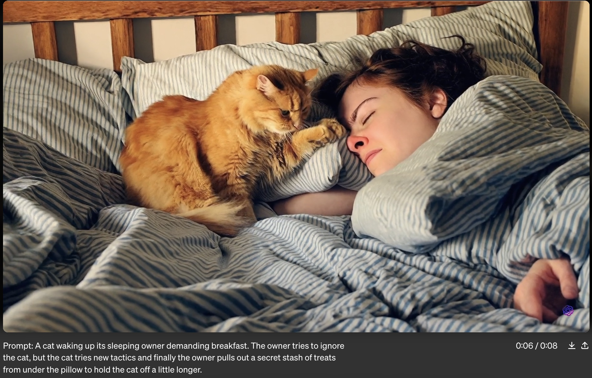

> "And each time we think we reached the peak of AI hype, the summit of bullshit mountain, we discover there's worst to come" - [Prof. Emily M. Bender](https://twitter.com/emilymbender)

# A Day in The AI Summer

It is one of the AI summer days, where almost every executive is hyped up about AI *(regardless of what it means)*. I enter a hall full of people in the tech industry attending an event held by a mid-size tech company!

### Scene #1
An executive is getting ready by putting his slides on the screen. I can immediately see an ugly AI-generated cover image. The executive gladly starts his presentation by referring to how he used AI, *which is definitely GenAI in this context*. He moves on with his slides which include more ugly, themeless or clip-art style images. **I look around and wonder, do people see how visually bad the slides are?**

### Scene #2
Another high level manager follows the executive to deliver a presentation. In the middle, she smiles and says *“Since everyone has to use AI these days, here’s an AI-generated image”.* The image is no better than any stock vector art. I would say it is even worse! **I wonder, has she thought about whether she really “had to use AI”?**

### Scene #3
Finally, a technical team member delivers a presentation, and guess what?! For sure, the slides are full of generated images. But there is something worse this time! The images include misspelled or corrupted text which completely distracts me. Yes, my brain could fill in the gaps, but it is sort of mind boggling after all! **I wonder, did the presenter even look at the image before pasting it in the slides? Did he notice the messed up text and ignore it out of laziness? Or didn’t he notice because of the automation bias?!**

At the end of the event, the attendees applaud the speakers and *I leave with many questions*!

 Few days later, I received a long email from the executive reflecting on the event. I smelled the traces of ChatGPT in the incoherence of the content. Or to be fair, I should say, I smelled the laziness of the executive to edit the content and refine his message!

**I thought, was this a live demo of the “Enshittification” of everything?**

# The Promise of "Revolutionizing" Everything!

With every tech hype there’s a promise of revolutionizing everything, raising productivity and providing abundance. One can not totally discard the “potential” positive impact of any new technology. But it is important to:

1. be aware of how it came to existence considering the underlying content theft and exploitation.

2. recognize entities and individuals who disproportionately benefit from the usage of the tools built on top of this technology.

3. observe the real manifestation of it in our daily lives versus the shiny “potential” sold by the entities benefiting from the proliferation of these tools.

**But what does "revolutionizing" mean? Is is alsways in a positive direction? And how does it look like more than a year after the peak hype around GenAI?**

As [@Iwillleavenow](https://twitter.com/Iwillleavenow) put it:

> People keep talking about the potential of GAI to revolutionize research, art, labor, etc. But it is already revolutionizing those things. It's making them worse.

<blockquote class="twitter-tweet">
People keep talking about the potential of GAI to revolutionize research, art, labor, etc. But it is already revolutionizing those things. It's making them worse.
&mdash; Crypti-Calli (@Iwillleavenow) <a href="https://twitter.com/Iwillleavenow/status/1755312461396197853?ref_src=twsrc%5Etfw">February 7, 2024</a></blockquote> 

I am sure that people will have different perspectives on what is better or worse according to where they stand. But within the last year, I could see more areas where quality degraded and more “content pollution” was created.

Let’s a see a couple of examples:

## Writing and Publishing

In the Verge’s [article](https://www.theverge.com/c/23194235/ai-fiction-writing-amazon-kindle-sudowrite-jasper) by Josh Dzieza, *The Great Fiction of AI: The strange world of high-speed semi-automated genre fiction*, we hear from authors who publish e-books with focus on delivering more titles faster regardless of the quality. Some would refer to what they produce as a “minimum viable book.” They’d say:

> “they’re using [Jasper.ai] not because they have something to say but because they need to say something in order to “maintain relevance””

One of the writers admitted that previously:

> She would dream about her characters and wake up thinking about them. As the AI took on more of the work, she realized that had stopped.   .... 
> It didn’t feel like mine anymore. It was very uncomfortable to look back over what I wrote and not really feel connected to the words or the ideas.

So reflecting on this, one can see that:

- In terms of quantity, more books would be available in the marketplace. Some readers wouldn't mind the low quality but more scams would appear, like any physical product with cheap replicas!
- In terms of the writer's experience, it doesn’t seem to make everyone happy. Because there is something about the process of writing beyond spitting out words.

**So what sort of revolutionization do we see here?**

Apparently, for some people like Sam Altman and his fans, the act of generating content, no matter how garbage or senseless, is an impressive outcome. 

<blockquote class="twitter-tweet">
openai now generates about 100 billion words per day.  all people on earth generate about 100 trillion words per day.
&mdash; Sam Altman (@sama) <a href="https://twitter.com/sama/status/1756089361609981993?ref_src=twsrc%5Etfw">February 9, 2024</a></blockquote> 

And with this mindset, they influence others to follow them, get impressed and feel the urge to use their tools!

## Art and Visual Content

Few days ago, OpenAI launched [Sora](https://openai.com/sora) which they describe as a model to *"create realistic and imaginative scenes from text instructions"*.

Many people were excited about it for different reasons. And definitly many artists are more angry at the new chapter of copyrights violation. 

But even if this was a resolved problem, I wonder:
- why do many people get impressed with a couple of examples or content that includes obvious flaws?
- why did OpenAI pick some bad examples, while trying to convince people that they *"teach AI to understand and simulate the physical world in motion"*?

Companies usually cherry-pick examples for demos. But here, OpenAI included things like the [cat video](https://openai.com/sora?video=cat-on-bed) where we see **a fifth paw for the cat and a disconnected hand/arm for the person!**

I think the options here are:
- OpenAI people didn't even notice the flaws!
- OpenAI bets on the low attention span, or the brain's ability to fill in the gaps.
- OpenAI would like people to lower their standards, feel intrigued to consume and pay for any sort of content regardless of the quality.

**But people don't have to feel compelled to generate or consume any content!**

# The “I have to use it” Argument!

> Since everyone has to use AI these days, here’s an AI-generated image.

That’s what the manager said on the AI summer day! 

Whenever I hear something like this, I would like to ask why?why?why?!

- Why is it a must?
- Why would you consciously contribute to the uglification of your work?
- Why wouldn't you use a couple of brain cells to look for a stock image and give credit or pay a few dollars to buy a design/font/photo from an artist? The outcome would have been better!

It is even more confusing for me, that the outcome in the presentations for every single speaker was objectively bad. They accepted this and even felt good about it!

Same for many things I see online, where the quality is poor, the art is not impressive, the style is not unique! 

# So Where Do We Go from Here?

Given all that, not only do we see degradation in the content, but also in the human's critical thinking and standards. 

For those who benefit from the hype, you are expected to see videos that don't make sense and cheer for them. You are supposed to feel compelled to use "AI" and be proud regardless of the result. You are should be hypnotized and feel impressed with each and every thing with a label of "AI"!

But it doesn't have to be like this! You have a choice see things through your own eyes. You have a choice to raise your standards. And you have a choice to ["resist the urge to be impressed"](https://medium.com/@emilymenonbender/on-nyt-magazine-on-ai-resist-the-urge-to-be-impressed-3d92fd9a0edd)! [^1]! 

-----

[^1]: [On NYT Magazine on AI: Resist the Urge to be Impressed](https://medium.com/@emilymenonbender/on-nyt-magazine-on-ai-resist-the-urge-to-be-impressed-3d92fd9a0edd), [Prof. Emily M. Bender](https://twitter.com/emilymbender)